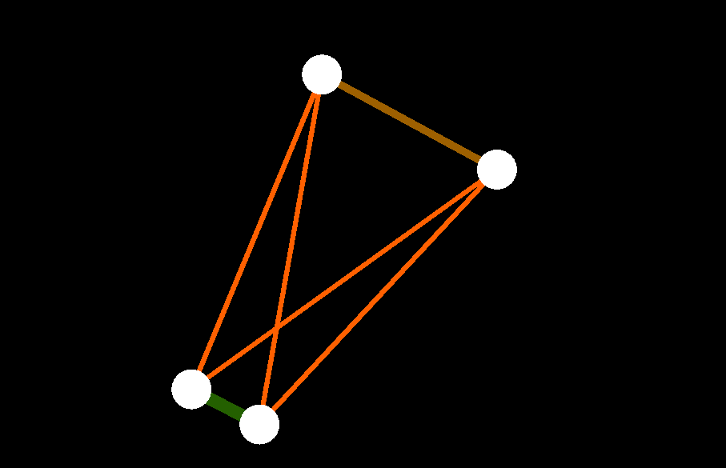

# particle-system
Here it is the simple prototype of a particle system. Now gravity, applying forces, collisions with walls and links between particles (springs) are supported.



## Building:

To build it you should be familiar with ```CMake```. Clone this repository, run ```CMake```, configure the project by specifying the path to SFML library (the recommended version of SFML is 2.5.1) and other appropriate options you would like to adjust. Generate files for building and build it.
